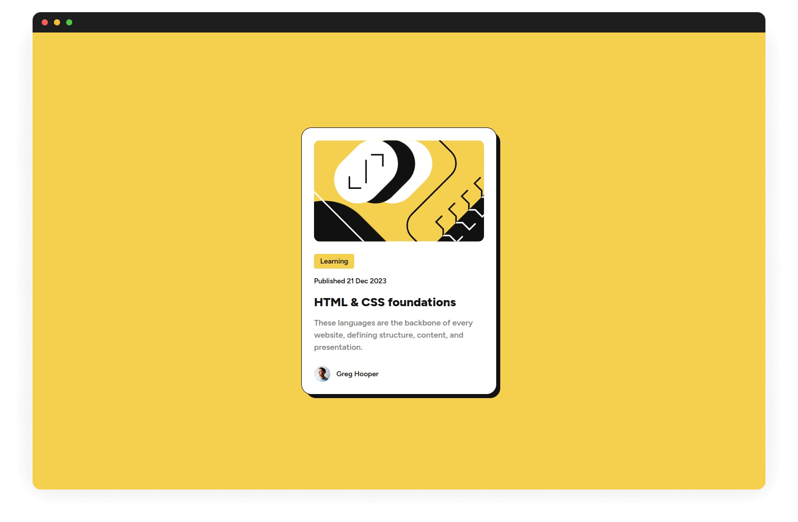
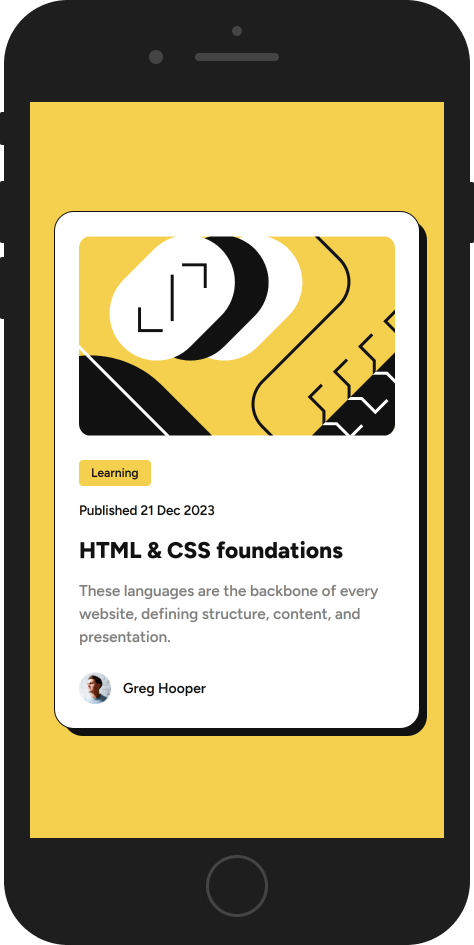
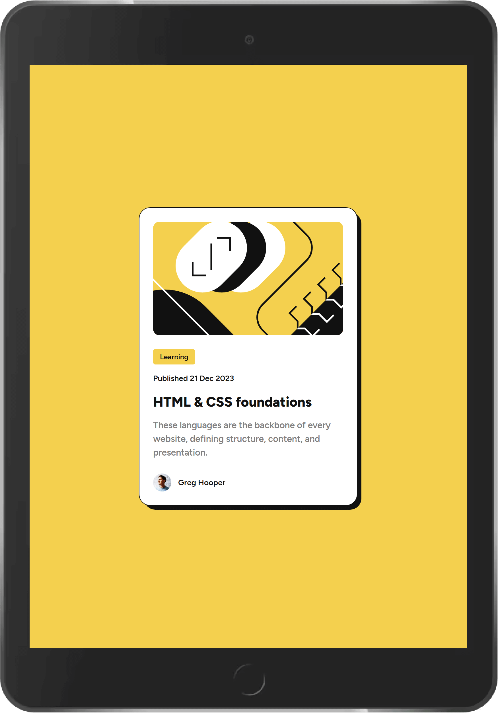

# Frontend Mentor - Blog preview card solution

This is a solution to the [Blog preview card challenge on Frontend Mentor](https://www.frontendmentor.io/challenges/blog-preview-card-ckPaj01IcS). Frontend Mentor challenges help you improve your coding skills by building realistic projects.

## Table of contents

- [Overview](#overview)
  - [The challenge](#the-challenge)
  - [Screenshots](#screenshots)
  - [Links](#links)
- [My process](#my-process)
  - [Built with](#built-with)
  - [Useful resources](#useful-resources)
- [Author](#author)

## Overview

### The challenge

Users should be able to:

- [x] See hover and focus states for all interactive elements on the page

### Screenshots

**Desktop**

**Mobile**

**Tablet**

### Links

- Solution URL: https://www.frontendmentor.io/solutions/blog-preview-card-using-react-typescript-vite-2IOM5z30un
- Live Site URL: https://effervescent-mousse-6c1e35.netlify.app/

## My process

### Built with

- React + TypeScript + Vite
- Mobile-first workflow
- Semantic HTML5 markup
- CSS custom properties

### Useful resources

- [Cards](https://inclusive-components.design/cards/)

## Author

- Website - [Josh Javier](https://joshjavier.com/)
- Frontend Mentor - [@joshjavier](https://www.frontendmentor.io/profile/joshjavier)
